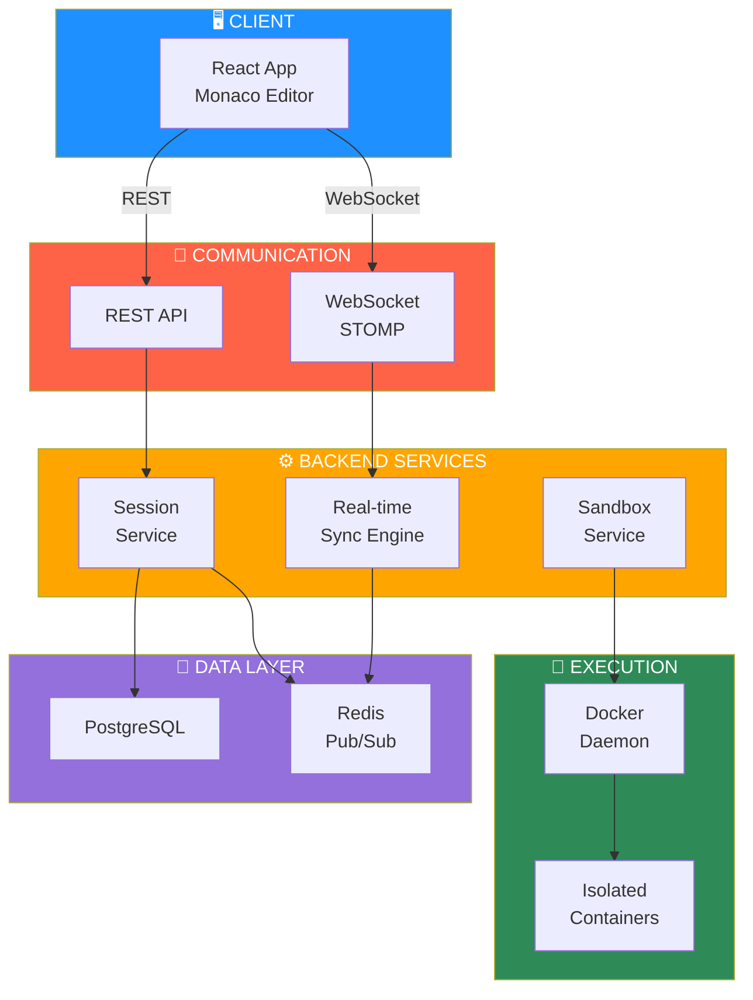
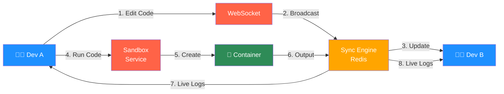
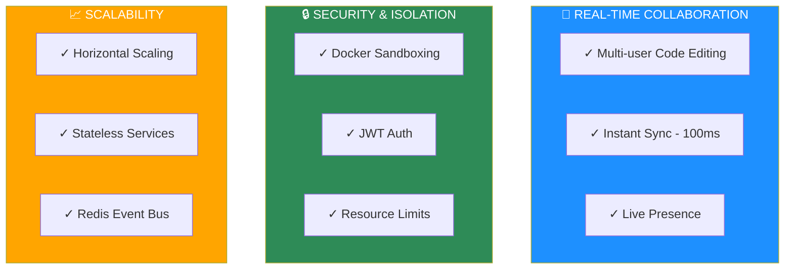
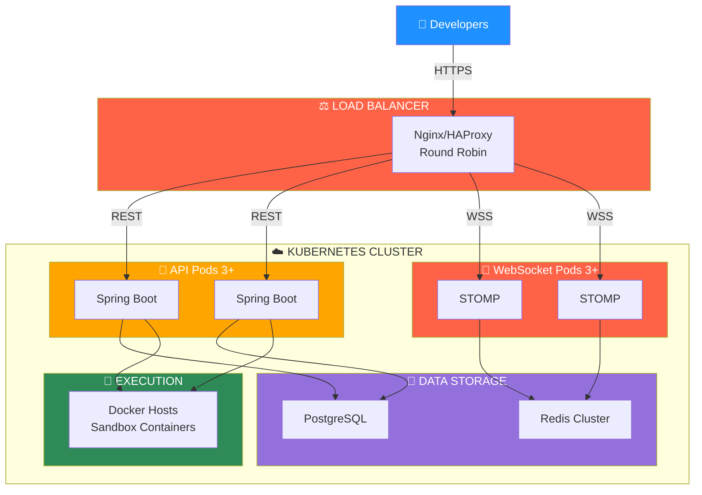

# CollabDebug
CollabDebug is a real-time collaborative debugging platform that lets developers edit, run, and debug code together in secure, Docker-isolated sandboxes. Built with Java Spring Boot, React, and WebSocket syncing, it brings Google Docs style collaboration to debugging workflows.

**CollabDebug** is an innovative platform that allows developers to collaborate on debugging code in real time. Multiple users can join a shared session, edit code together, set breakpoints, and view execution logs, all within isolated Docker containers to ensure security and reproducibility.

## 🏗️ System Architecture

## 🔄 Real-Time Collaboration Flow

##  Why CollabDebug Stands Out
- Real-time collaborative code editing with state syncing (like Google Docs).
- Secure Dockerized sandboxes for isolated and reproducible code execution.
- Built from scratch using modern technologies: Java Spring Boot, Docker, React, WebSocket, and Deep Java Library.

## System Design Highlights

### 1. **Real-Time Synchronization Engine**
- **STOMP/WebSocket Protocol**: Bidirectional, low-latency communication between clients
- **Redis Pub/Sub**: Distributes events across multiple backend instances for horizontal scalability
- **Conflict-Free Sync**: State-based synchronization ensures eventual consistency
- **Presence Tracking**: Real-time participant awareness (< 100ms join/leave events)

### 2. **Multi-User Code Editing**
- **Monaco Editor Integration**: VSCode-like editing experience with syntax highlighting
- **Operational Transformation**: Manages concurrent edits from multiple developers
- **Session State Management**: Maintains single source of truth for session code state
- **Persistent Snapshots**: Session data saved to PostgreSQL for recovery and history

### 3. **Isolated Execution Environment**
- **Docker Container Sandboxing**: Each code execution runs in isolated, ephemeral containers
- **Resource Constraints**: CPU, memory, and network limits prevent resource exhaustion attacks
- **Security Isolation**: Containers prevent unauthorized access to host system
- **Live Log Streaming**: Output captured and delivered to all participants in real-time

### 4. **Authentication & Authorization**
- **JWT-Based Auth**: Stateless authentication across distributed backend instances
- **Role-Based Access**: Session owners vs. participants with different permissions
- **Token Validation**: JWT interceptor validates every WebSocket connection
- **Secure Session Isolation**: Users can only access sessions they're authorized for

### 5. **Scalability Architecture**
- **Stateless REST API**: Horizontal scaling with multiple instances
- **Redis as Event Bus**: Decouples services and enables event-driven architecture
- **Session Affinity**: WebSocket connections can be load-balanced while maintaining state via Redis
- **Database Persistence**: PostgreSQL stores all session data independently of instance lifecycle

##  Tech Stack
- **Backend**: Java 17, Spring Boot, Docker Java API, PostgreSQL, Redis, JWT Authentication.
- **Frontend**: React, Monaco Editor (VSCode-like interface), WebSocket communication.
- **Security**: Isolated containers, resource constraints, sanitized input handling.
- **Future Enhancements**: CRDT-based collaborative editing, ML-powered debugging suggestions, scalability improvements,Uploading projects instead of file.

## ⚡ Key Features

## 🚀 Production Deployment

## Design Patterns & Architectural Decisions

### Distributed Systems Patterns
| Pattern | Implementation | Benefit |
|---------|---|---|
| **Pub/Sub Event Bus** | Redis Pub/Sub | Decouples services, enables horizontal scaling |
| **Stateless API** | REST controllers with Redis state | Load balancing without session affinity |
| **Service Locator** | Spring dependency injection | Loosely coupled, testable components |
| **Circuit Breaker** | Docker execution timeouts | Fault tolerance, prevents cascade failures |
| **Event Sourcing** | Session edit events in Redis | Complete audit trail, easy replay/recovery |
| **CQRS** | Separate read/write paths via WebSocket | Optimized for real-time updates and queries |

### Security & Isolation
- **JWT Authentication**: Stateless, scalable auth without server-side sessions
- **Container Sandboxing**: Each code execution isolated with resource limits (CPU, memory, disk)
- **Network Isolation**: Containers cannot access host or other containers
- **Role-Based Authorization**: Fine-grained permissions (owner vs. participant)
- **Input Sanitization**: All user code validated before Docker execution

### Real-Time Collaboration
- **Operational Transform**: Handles concurrent edits without conflicts
- **Presence Awareness**: Redis Pub/Sub delivers join/leave events < 100ms
- **Optimistic Updates**: UI reflects changes immediately, synced asynchronously
- **Conflict Resolution**: Last-write-wins with timestamp-based ordering

##  Features (Phase 1 MVP)
✅ User registration and authentication  
✅ Create and manage debugging sessions  
✅ Code upload and execution within Docker containers  
✅ Real-time code editing with WebSocket-based syncing  
✅ Output logs streamed to users instantly

##  How to Run Locally

### Prerequisites
- Java 17+
- Docker Desktop
- Node.js and npm/yarn
- PostgreSQL and Redis installed locally

### Steps
1. Clone the repository:  
   `git clone https://github.com/Monica0077/CollabDebug.git`
2. Start Docker Desktop.
3. Run the backend:  
   `cd collabdebug-backend and then run the backend via any java editor`
4. Run the frontend:  
   `cd collabdebug-frontend && npm install && npm run dev`
5. Open `http://localhost:5174` and start collaborating!

##  Real-Time Presence System - Redis Pub/Sub Implementation

###  Latest Update: Real-Time Participant Updates

**Updates:**
- ✅ Participants now appear **instantly** (< 100ms) instead of after 30 seconds
- ✅ Join/leave events delivered via Redis pub/sub
- ✅ Real-time collaboration fully enabled

**Architecture:**
- **PresenceListener** - Receives presence events from Redis
- **EditMessageListener** - Receives code edits from Redis
- **SessionMetaListener** - Receives metadata changes from Redis
- **SessionEndListener** - Receives session end events from Redis

##  Future Roadmap
- Add multi-language debugging support.
- Implement CRDT for conflict-free editing.
- Allow Users to upload projects instaed of file.
- Integrate machine learning models for real-time error suggestions.
- Add Manage Team Members feature

---

